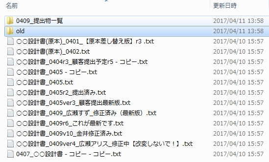
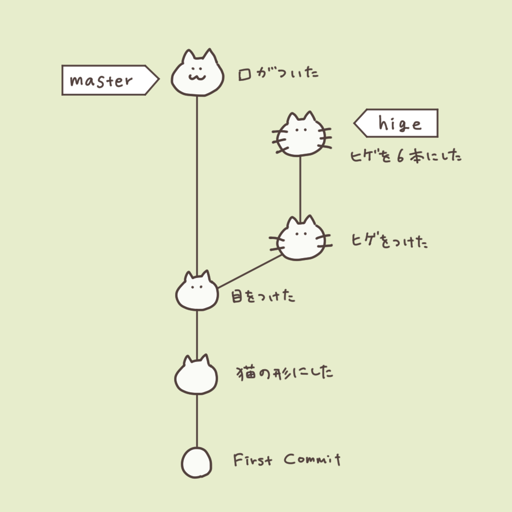

<!-- page_number: true -->
<!-- $size: 16:9 -->


FY19 VORTEX FUNトレーニング
Pythonスキルアップチーム勉強会
==
## 第1回
2019.9.28

---

本日のアジェンダ
==
## 午前の部
- Pythonおさらい
- Pythonプログラミングを始めよう
- Pythonをもっと知ろう
- 開発環境のススメ　・Python仮想環境のススメ
- git基礎
## 午後の部
- githubプチハンズオン
- 「世界のナベアツ」を作ろう
---

講師自己紹介
==

---

Pythonおさらい
==

---
Pythonとは　その１
==
- 1989年、オランダ人エンジニアであるグイド・ヴァン・ロッサム氏が発案、開発
- オープンソースプロジェクトであり、利用は無料
  - オープンソースプロジェクトのリーダーに与えられる称号「優しい終身の独裁者」を最初に得た人物はこのグイド氏。なお2018年7月に引退している
- 「クリスマス休暇の暇つぶし」が開発のきっかけ
- 名称は、イギリスBBCのコメディ番組「空飛ぶモンティ・パイソン」から。本人が熱烈なファンとのこと
- マスコットはニシキヘビ（英語でPython）
- 科学技術計算や機械学習用ライブラリが充実しており、これらのジャンルでは事実上、標準言語となりつつある
- OpenStack / ansible / yum などの著名なOSSの開発言語でもある

---

Pythonとは　その２
==
- CLIだけでなく、GUIを持つアプリケーションの開発も可能
- 強い動的型付けのインタプリタ型スクリプト言語（コンパイルが不要）
- { }などのカッコでなく、インデントでループや条件分岐の範囲を表現する
- 推奨される書式が規格化されているため、誰が書いても近い見た目になる＝コードが読みやすい
- インタプリタは、C言語で実装されたCPythonが最も一般的だが、Javaで実装されたJython、.NETで実装されたIronPythonなどがある
- 動作速度は十分高速だが、JavaやCと比較すると5~10分の1程度遅いとされる。ただし、静的型付けをするCython(CPythonではない)では、Cに匹敵する速度が出せるとされる

---

Pythonのバージョン
==

- 現在使われているPythonには、バージョン２系と３系がある
- バージョン３では、利便性の向上やバージョン2での問題が解決された。が、
- バージョン２と３の間には**互換性がない**ので注意
- バージョン２系の最終は2.7で、２０２０年１月でサポートが終了
- RHEL7やCentOS7は今だPython2が標準（yumなどはPython2で実装）
- 最新のUbuntu,Fedoraなどの先進的なLinuxではPython3が標準
	> Python2が入っていないので実行時にオプションを付けないとansibleが動かなかったりする
## Pythonはバージョン３系を使いましょう！！
- 参画した案件でPython2を使っていたら、設計担当のSEは無能です。速やかに離脱しましょう。
- どうしても抜けられない場合は、Python3との互換性を保つ仕組みが沢山あるのでそれを使いましょう（今回は割愛）

---

Pythonプログラミングを始めよう
==

---

基本3構造
==
- どんな複雑なプログラムも、以下の3つの構造の組み合わせで動いている
## 順次処理
- 上から順番に処理を実行する

## 条件分岐
- 条件よって処理を選択する
 
## 繰り返し
- 同じ処理を繰り返し実行する

> 人間も同じですね

---

基本3構造のわかり易い例
==

## fizzbuzzプログラム
```
for i in range(1, 101):
    if i % 15 == 0:
        print("Fizz Buzz!")
    elif i % 3 == 0:
        print("Fizz!")
    elif i % 5 == 0:
        print("Buzz!")
    else:
        print(i)
```
- 変数 i が101になるまで i を1づつ増加　（for文、繰り返し）
- i が15、5、3で割り切れたら、それぞれの処理を実行（if文、条件分岐）
- 上記の処理を上から順に実行する（順次処理）

---


変数とは
==

```
print(1+1)
```
### 上記のプログラムは無意味だ。理由は・・・
- 1+1の計算結果を表示することしかできない
```
a = 1
b = 1
print(a+b)
```
### 上記のプログラムは無意味ではない
- 好きな値２つの合計を得られる
## 好きな値を好きなタイミングで入れられる箱、それが変数

---

変数の型
==
- 「1と1を足す」場合、1と数字と見るか文字と見るかで結果が全然違う
	- 数字の場合・・・2
	- 文字の場合・・・11
- 変数の中の値をどう扱うかを決めるため、変数には「型」が必要
- Pythonは「強い動的型付け」言語。つまり・・・
	- 動的型付け・・・変数を宣言したときに型を決める必要がない=実行時にインタプリタがよしなに調べてくれる
	- 強い・・・異なる型同士を計算することはできない。
- Pythonが遅いと言われる理由は、動的型付けであるがゆえに、ループや関数の呼び出しなどの際にインタプリタによる型の確認が行われるから 

---
変数の型（具体例）
==

#### Java（静的型付け言語）の例
- 予め型を宣言しておく必要がある
```java
int a=1; //変数aをint型で宣言
String b="hoge"; // 変数bをString形で宣言
```

#### Pythonでは
- 入れた値によって型が自動で決まる
```Python
a = 1  ##数値を入れたのでaは数値型になる
b = "hoge" ##文字（""で囲む）を入れたのでbは文字列型になる
```
- どちらの言語も、aとbは型が違うので計算することはできない
- ちなみに「弱い動的型付け」言語であるJavaScriptでは計算可能


---

Pythonの変数型
==

### 文字列型
- "（もしくは'）で囲った値を代入した変数は文字列型になる
```Python
moji = "hoge"
suji = "123"
kanji = "風林火山"
```
### 数値型
- 数字を"(')で囲まずに代入した場合は数値として扱われる
```Python
int = 123 ##整数型
float = 123.0 ##浮動小数点型
```
- Python3のint型は64ビット以上の桁も扱える
---

値のまとまりを扱う型
==
- 1つの変数で複数の値を扱いたい場合に使用する。正確には「コレクション」と呼ぶ。
- 変数には、好きな型の変数を好きなだけ入れられる。入れ子することもできる。

### リスト
- いわゆる配列。[]で囲む。順序があり、任意の位置の任意の個数の値を取り出せる。
```
list_ = [1,2,3,"a","b",[4,5]]
```
### タプル
- 中身を変えることができないリスト。()で囲む。リストよりも軽量で、高速に動作する。
```
tuple_ = (1,2,3,"a","b"(4,5))
```
> 実際には、（）で囲まなくても「,」で区切るとタプルになる
---

値のまとまりを扱う型（つづき）
==

### 辞書
- キーと値をセットにしたもの。{}で囲む。順序は決められない。キーは重複してはいけない。
```
dictionary = {"key":"value","a":1,"list":[1,2,3]}
```
> 順序を決められるOrderedDictというものもある
### 集合（セット）
- 重複しない値が入る。辞書をキーだけにしたイメージ。重複要素を除いたり、他の集合と集合演算して要素を取り出したりするのに使う
```
set_ = {1,2,3,"a","b"}
```

---
型の変換
==
- Pythonの型付けは「強い」ので、違う型同士の計算の際は型変換が必須になる
#### 例１　数値から文字への変換
- ユーザーIDがint型だけどそれを使ってRESTAPIを叩きたい時など
```
uid = 10 ## int型
url = "/user/"+str(uid)+"/info" ## /users/10/infoという文字列になる
```
#### 例２　リストから集合に変換
- リストの要素の積集合を取りたいときなど
```
male = ["jin","takashi","chisato"]
female = ["chisato","madoka","risako"]
male_set = set(male) ## 男性名の集合ができる
female_set = set(female) ## 女性名の集合ができる
male_set & female_set ##{"chisato"}
```

---

イテレータ
==
- コレクションをfor文などで扱うと、持っている値を順に取り出してくれる
#### listリストに入っている1,2,3を順に表示する場合
```Python
list_ = [1,2,3]
for i in list_:
  print(i)
```
- この場合、list_のことをイテレータ（イテレータオブジェクト）と呼ぶ
- タプル、集合、辞書はもちろん、文字列もイテレータ。数値型はイテレータではない
> list_ と、わざわざ_を付けてるのは、listがPythonの予約語（厳密には組み込み関数）だから

##### （参考）イテレータを知らなかった場合の残念なforループ
```
for i in range(0,len(list)):
    print(list[i])
```
---

ミュータブルとイミュータブル
==
- 変数には、値の変更が可能なものとそうでないものがある
### ミュータブル
- 値の変更が可能なもの・・・リスト、辞書、集合、クラス、インスタンス、など
```python
list_ = [1,2,3]
list_[2] = 4  ## [1,2,4]
```
### イミュータブル
- 値の変更ができないもの・・・文字列、数値、タプル、など
```python
string = "hoge"  ## mogeに変えたい
string[0] = "m"
TypeError: 'str' object does not support item assignment
```
> string="moge"とやるともちろん成功するんですが、理由はまた、次回。

---

関数
==
- ある入力を与えると出力を返す、処理のカタマリのこと	
### 関数を使うとき
##### 何度も出てくる同じ内容の処理を共通化したいとき
- 同じ処理が何度も出てくるコードは読みにくいしメンテナンス性も低い
- ただし、共通化した関数の変更はリスクが大きい。単体テストを書くことが大事
##### if文やループが深くなってきた時
- 他人（数カ月後の自分を含む）は、3重を超えるif文を簡単に理解できないと言われる
- if文が深くなりそうなら、関数で外出ししたほうがよい
##### 処理を部品化したいとき
- 関数にすることで、モジュール（後述）としてimportできるようになる

---

引数とパラメータ
==
- 関数に計算してほしい値は引数として渡す。引数の個数は特に制限はない
#### 引数、実引数（arguments）
- 関数に渡す値（計算してほしい値）のこと
```
add_num(1,2)
```
#### パラメータ、仮引数（parameters）
- 関数のほうで、実引数を受け取る場所のこと
```
def add_num(augend, addend)
```
- 仮引数は関数の中でしか有効でないので、好きな名前をつけてOK
	- 何をする関数かをわかりやすくするため、具体期な名称を付けたほうがよいとされます

---

位置引数
==
#### 位置引数
- 引数の場所が決まっている。実引数と仮引数の数は合ってないといけない。また、位置を入れ替えると正常に値が渡せない
```Python
def hoge(a,b)

hoge(1,2) # a=1,b=2
hoge(1) # 引数が足りないのでエラー
```
- 仮引数に「*」をつけると、複数の位置引数をまとめられる。関数内ではタプルになる
```Python
def hoge(a,b,*args)

hoge(1,2,3) # 1,2,(3,)
hoge(1,2,3,4,[5,6,7]) # 1,2,(3,4,[5,6,7],)

```
> 習慣的に、タプルの位置引数は *args と書かれる
---

キーワード引数
==
- 'param=1'のように記述した実引数は、キーワード引数と言われる
- 仮引数側（関数側）の見た目は、位置引数と特に変わらない
```Python
def hoge(a,b)

hoge(a=1,b=2) # a=1,b=2
``` 
- 仮引数に ** をつけると、キーワード引数を辞書で受け取る
```Python
def hoge(a,b,**kwargs)

hoge(a=1,b=2,c=3,d=4) # a=1,b=2,{c:3, d:4}
``` 
> 習慣的に、キーワード引数は \**kwargs と書かれる

---

仮引数のデフォルト値
==
- 仮引数には、値が渡されなかった場合に備えて予めデフォルト値を決めておくことができる
```Python
def hoge(a,b=0)

hoge(1) # a=1,b=0 デフォルト値があるので実引数が1個でもエラーにならない
```
- キーワード引数と混乱しやすいが、こちらは仮引数（関数側）。キーワード引数は実引数（呼び出し側）
- デフォルト引数は、関数が定義された時しか初期化されない。ミュータブルな値を渡すと思わぬバグの原因になるので注意
```Python
def hoge(a,b=[]): # リストはミュータブル
    b.append(a)
    return b

hoge(1) # [1]
hoge(2) # [2] を期待するかもしれないが、実際は[1,2]になる
```
---

Pythonの定数
==
- 変数と違い、中身を変えることを目的としないものを定数と呼ぶ。定数は、大文字で記述する（ただの変数なので書き換えは可能）
```
FILENAME = './hoge.json'
```
### Python組み込み定数（主要なもののみ）
- 組み込み定数はイミュータブルなので書き換えはできない
##### None
- 値が存在しないことを示す定数。returnがない関数の戻り値、辞書に存在しないキーが指定された時、などなど。
##### True / False
- いわゆる真偽値型（bool/boolean型）
- 数値のゼロ、空の文字列やコレクションはFalseとなる

---

Pythonをもっと知ろう
==

---

クラス・モジュール・パッケージ・ライブラリ
==
#### クラス
- 関連性のある処理の集まりや、データ構造の定義や、データ構造に対して行う処理などをまとめたもの
- オブジェクト指向で言うところの、インスタンスの設計図でもある
> クラスについては次回詳しく解説するので今は適当な理解でOKです
#### モジュール
- ファイルに書かれたPythonコードのことのうち、関数やクラスとしてまとめられているもの
> ファイルに書かれてないものって何やねん・・・と思うかもしれないですが、REPLやjupyter noteboookなどのコードが該当します
- importすることで、他のPythonコードから関数やクラスを利用できる
> これも次回詳しく解説予定です

---

クラス・モジュール・パッケージ・ライブラリ（つづき）
==
#### パッケージ
- 複数のモジュールをディレクトリに収めたもの
- ディレクトリにモジュールを入れることで、モジュール名が他人のものと衝突することを防ぐ
- ディレクトリには、必ず \_\_init__.pyというファイルを置く必要がある
- 使用するときは、from パッケージ名 import モジュール名　という階層で指定する
```
from kanaipackage import FetchApi 
```
> importの指定方法はいろいろあります。また、いずれ・・・
#### ライブラリ
- 複数のパッケージを集めたもの
- 単に、沢山のパッケージやモジュールのある場所、程度の意味合いで使われるくらいなのであまり気にしなくてよいです
---

標準/拡張モジュール
==
- Pythonは「バッテリー同梱」と呼ばれ、有用なライブラリはランタイムに付属させているのをポリシーとしている
	> バッテリー同梱・・・電池付属で箱を開けたらすぐ遊べるおもちゃのこと
- 標準で含まれている機能のことをビルトインモジュール（ビルトインライブラリ）と呼ぶ
- ベンダーや有志によって、Python標準以外のモジュール=拡張モジュールも多数提供されている
	- 機能を拡張するもの・・・paramiko, Jinja2など
	- クラウドサービスや製品のAPIを扱いやすくしたもの・・・AWS boto3など
	- 標準モジュールをより使いやすくしたもの・・・requestsなど
	- 特定の用途向けやフレームワークなど・・・beautifulsoap, tensorflowなど
- こんな機能が欲しい、、、と思ったらほとんどは拡張モジュールで解決できるので、積極的に利用しよう

---

pipとは
==
### 拡張モジュールをインストール、管理するためのコマンド
- 拡張モジュールのほとんどは、pipコマンドでインストールできる
- ライブラリは、PyPIというPythonの拡張モジュールのレジストリからインターネット経由でダウンロードされる
- pip自体は、yumやaptでインストールするのが簡単だが、ややバージョンが古いことが多い
- 拡張モジュール以外に、ansible,awscli,docker-composeといった、Python製のアプリも入手可能
- 拡張モジュールの中には、C言語で実装されたものも多い。それらをpipでインストールする場合は、gccやcffiなどのコンパイラやライブラリを予めインストールしておく必要がある

---

Pythonコーディング規約について
==
- Pythonでは、可読性を高めるためコーディング規約が厳しく決められており、**PEP8**としてまとめられている
#### PEP8抜粋
```
1つのインデントごとに，スペースを4回入れる
すべての行の長さを，最大79文字までに制限する
常にUTF-8を使用するべき
2項演算子は、両側に常にひとつだけスペースを入れる
```
- PEP8に従わなくてもシンタックスエラーになることはない
- 書いたコードを自動でPEP8準拠にフォーマットしてくれる機能があるので、積極的に利用するべき
	- autopep8,yapf,flake8など　（pipでインストールする）
	- Pycharmでは、option + command + Lキーの組み合わせでコードを自動整形してくれる

---

開発環境のススメ
==

---

開発環境とは
==

- プログラムを開発しやするするためのアプリケーションのこと。強力なエディタみたいなもの
- 昨今ではIDE（統合開発環境）と呼ばれ、プログラムの作成、GUIのデザイン、コンパイル、実行、デバッグ、製品としてパッケージ化するなどの豊富な機能を持つ
### IDEちょっと紹介
- Eclipse
	- Javaの無料開発環境として有名。プラグインが豊富。
- Intellij IDEA
	- JetBrains社によるIDE。 Java以外に、Pycharm（Python）,WebStorm(PHP/HTML)などの派生品がある。無料でもかなり高機能

---

なるべく「開発環境」を使おう
==
- サクラエディタや無垢なvimでもいいんですが・・・
	> ちなみにvimはちゃんとカスタマイズするとIDE並の強力な機能を持ちます

### IDEを使った方がよい理由
- コード補完が効く　→　構文エラーなどを防げる、関数の仕様などを調べる時間を短縮できる
- シンタックスハイライトが効く　→　カッコの閉じ忘れ、スペルミスなどを防げる
- 豊富な補助機能（コードの自動整形、タイポの指摘と自動修正など）と、そのショートカットキーが豊富で作業効率が上がる
- 強力なリファクタ機能を持つ
- 開発→実行（テスト）→デバッグの流れが非常にスムーズ
- ビルドツールやテストツール、DBマネージャなどの外部ツールとの連携が強力
- 見た目がかっこいい＝デキる気がする

---

AWS Cloud9の紹介
==

- 本勉強会では、AWSのサービスである「Cloud9」を利用します


- かっこいい！ 

---

AWS Cloud9の特徴
==

- webブラウザとインターネット環境さえあればどこでもIDEを実行できる。IDEのインストールやメンテナンスは一切不要
- JavaScript、Python、PHP などの言語に対応
- 複数人で同時にコード編集が可能
- 標準で、git / docker / SAM（ServerlessApplicationModel）を提供。チーム開発、単体テストなどをcloud9だけで実施可能
- AmazonLinuxもしくはUbuntuのEC2上で起動しておりシェルコンソールを持つので、sshターミナルの代用としても使える
- Cloud9自体の利用料金は無料。Cloud9の動くEC2にだけ課金される
- ブラウザを閉じて30分後（変更可）に、自動でEC2が停止する

---

Python仮想環境のススメ
==

---

Python製アプリを使うときに起こりうる問題・・・
==
- Pythonで書かれたアプリケーションは、様々なライブラリを利用している事が多い＝依存関係がある
- 複数のPython製アプリを１つのマシン内で動かしたい場合、アプリが依存するライブラリのバージョンが異なったりして問題が起こることがある
	- あるライブラリAを利用するPythonアプリBとCがあったとき、AをバージョンアップしたらアプリCが動かなくなる・・・とか割とよくある	
- アプリが使うPythonのバージョンが違う場合、Pythonをフルパスで指定したり依存ライブラリの場所を指定したりと、結構めんどくさい・・・
> Python2アプリとPython3アプリが同じOSに混在してすることはよくありますね

## Pythonアプリを閉じ込めて、他のPythonアプリと環境が混ざらないようにしよう＝仮想環境

---

具体的にはこんな感じ
==

```
+-----------------------------------------------------+
| +---------------+ +--------------+ +--------------+ |
| |               | |              | |              | |
| |  Python3.7    | | Python2.7    | | Python3.4    | |
| |  ansible==2.8 | | ansible==1.9 | | ansible==2.4 | |
| |  Jinja2==2.10 | | Jinja2==1.15 | | Jinja2==2.11 | |
| |               | |              | |              | |
| |  仮想環境1     | |  仮想環境2   | |  仮想環境3    | |
| +---------------+ +--------------+ +--------------+ |
+-----------------------------------------------------+
```
- それぞれの環境は独立しており、Python自体やライブラリの変更が他の環境に影響を与えることはない
- 仮想環境１でpythonコマンドを実行するとPython3.7が起動するが、仮想環境２の場合はPython2.7が起動する
- ansibleをバージョンアップしたい時、共通のライブラリの依存関係や、既存のバージョンを意識しないで済む = **運用が楽**

---

仮想環境の種類
==
## virtualenv
- 元祖仮想環境（確か）。仮想環境で使うPythonのバージョンを指定することができる
## pyenv
- 好きなPythonバージョンで仮想環境を作れる。日本での人気が高い
## venv
- Python3.3からビルトイン。venvを実行したバージョンのPythonのみ利用可能。簡単なのでおすすめ。ただしPython3系のみ対応
## pipenv
- 最新型の仮想環境。仮想環境の作成（venv）とパッケージ管理（pip）を合わせた感じ

---

venvを使ってみよう
==
```
$ pip list
```
- インストールされたpipモジュールが沢山出てくるはず
```
$ python3 -m venv testenv
```
- testenvという仮想環境ができる。Pythonインタプリタは、Python3.7（実行したコマンドのバージョン）
```
$ source testenv/bin/activate
```
- これだけで、testenvの閉じた仮想環境に入る。プロンプトが変わっているはず
```
(testenv)$ pip list
```
- 最初のpip listの結果とは違うはずだ

---
git基礎
==

---
gitのない世界
==
- これはある案件で使っているファイルサーバのフォルダです

- どれが顧客に渡したものか、すぐにわからない
- どれが最新か、すぐにわからない
- 誰がどのファイルにどんな変更を加えたか、すぐにわからない
### ファイルサーバによるファイル共有では、チームでプロジェクトを進めるのが結構難しい。gitが必要だ・・・

---

gitとは
==
- ソースコード管理システム（VCS）の一つで、分散VCSと呼ばれる
	> 何が分散かは、後程解説いたします
- 誰が、いつ、どのファイルの、どの行に、どんな変更を加えたかの履歴を管理する
- オープンソースプロジェクトのソースコード管理において、gitは事実上の標準となっている
	- VCSには、gitの他、Subversion、Mercurialなどがある
- クライアント・サーバモデルである
	- 作業端末上ではgitクライアントを利用する。クライアントには、CLIコマンドの他、GUIアプリケーションもある
	- サーバには、http/httpsもしくはssh、あるいはgitオリジナルのプロトコルで接続する

---

git余談
==
### Linuxカーネルのソース管理のために、リーナス・トーバルズ御大自らが開発
- もともと使っていたVCSのライセンス切れと、使い勝手に疑問を感じていたので自分を作ることにしたとのこと
- Linuxコミュニティから離れ、10日間雲隠れして一気に開発された
- 名称は、アルファベット３文字で、過去に使われてないものなら何でも良かったらしい
### 世界中のオープンソースプロジェクトを支える
- Linuxカーネルのメンテナーは世界に数万人いて、毎週1000を超えるファイルに対し2万箇所以上の変更が加えられる
- 非常に多くの著名なオープンソースプロジェクトがgitで管理されている
- ドキュメントの管理能力が非常に高いので、出版社とライターが原稿のやり取りに使ったり、弁護士向けにword専用のgitサーバのSaaSを提供している会社もある

---

gitを使ったおおまかな作業の流れ
==

1. プロジェクトを発⾜し、サーバ上に「納品物の置き場」を作る
2. プロジェクトメンバーは、納品物の置き場から、「各⾃の作業場」をそれぞれ作る
3. 各⾃の作業場で、ファイルを変更したり追加したり動作確認をする。各自のタイミングで、作業を「確定」して作業に履歴を付ける
4. 各⾃の作業が終わったら、作業内容をサーバ上の「共有場所」 にアップロードする
5. 共有場所でみんなでレビューし、指摘や議論をする。
6. 各自は、指摘内容の修正や再テストなどを行い、再度共有場所にアップロードする
7. 指摘内容が全て解決されたら、各⾃の作業結果を納品物の置き場に取り込む
8. 納品物を顧客に納品する、あるいはリリースする
#### 従来の開発の進め方と大きく変わりません。ただ、個々の作業の効率化にgitは大きく貢献します

---

重要キーワード：リポジトリ (Repository)
==
### gitで管理するファイルの置き場であり、作業履歴を保管する場所のこと
- 前ページでの「納品物の置き場所」「各自の作業場」「共有場所」がリポジトリに該当
	> 厳密にはちょ～っと違うのですが一旦この理解でOKです
- リポジトリが置かれる場所によって以下の2種類に分けられる
#### ローカルリポジトリ（各自の作業場）
- 自分の作業端末にあるリポジトリのこと
	> ディレクトリ、と理解して一旦OKです
#### リモートリポジトリ（納品物の置き場、共有場所）
- サーバ上にある、作業者たちで共有するリポジトリのこと
- http/httpsやsshのほか、git独自プロトコルでアクセスする

---

重要キーワード：コミット (commit)
==
### リポジトリに対して、作業履歴を書き込むこと
- コミットすると、その時のディレクトリの中身が、作業者名・時間・任意のメッセージと共にリポジトリに記録される
- コミットには一意の番号（リビジョン）が自動で降られ、リビジョンを指定することでいつでも好きなコミットに戻ることができる
	> あるファイルを作成する前のコミットに戻ると、当然そのファイルは無くなるので驚きますが、リポジトリにはちゃんと残っています
- コミットは作業者の好きなタイミングで実施できる。コードを1行書き換えた、バグを取り終わった、大きな変更をするので戻ってこれるように印をつけておきたい、など
	> ゲームで言うsaveと同じ感覚です
- コミットするとコードが壊れることを恐れずに先に進めるので、個人での趣味の開発でもgitは非常に役出つ！みんなgitを使おう！

---

分散VCSとは
==
### リポジトリが、ローカルマシンやネットワーク上のサーバに分散して置かれるVCSのこと
- 分散型でないVCSでは、コミットとは、「サーバ上のリポジトリにコミットすること」
#### 何が困るか
- ちょっとsaveしたいだけなのに、他の作業者から見えるところにコードを置かないといけない
- 単体テストなどの動作確認が終わってないコードを公開してしまう
#### 一方、分散VCSでは・・・
- ローカルリポジトリに好きなタイミングで好きなだけコミットできる
- ローカルで十分に検証が終わってから、自信をもって公開できる
### Linuxカーネルのような超大規模のプロジェクトが進行できるのは、分散VCSだから！

---

重要キーワード：ブランチ (branch)
==
### コミットに付けられた別名・・・というとややこしいが、リポジトリ内に「パラレルワールド」を作ること
> もっとややこしい？ｗ
- ソフトウェアの開発や維持保守は複数の作業を同時に進められるのが望ましい
  - あるチームは、新機能の追加
  - 別のチームは、バグフィックス、などなど
- 一人作業であれば、ローカルリポジトリで作業→リモートにアップロード、だけでなんとか回りそうだが・・・
- 別の作業をしている他のチームのコミットがどんどん重なっていくのはなかなか辛い


---

重要キーワード：ブランチ (branch)　つづき
==
### リポジトリの中にパラレルワールドを作って、独立したらええやん＝ブランチ
- あるコミットから先を別のブランチに分け、それぞれの作業のコミットを追加していく
- ブランチでの作業が完了したら、他のブランチと合体させる = **マージ**

<div style="text-align:center">https://kray.jp/blog/git-pull-rebase/</div>

---

gitとgithub (とgitlab)について
==
#### git
- 仕組みの名称。gitコマンドを指すこともある
#### github
- 世界最大のリモートリポジトリを提供するSaaS
- リポジトリの他、コードレビュー機能、課題管理、進捗管理、CI/CDなど開発に必要な多くの機能を提供する
- オープンソースであれば利用は無料
#### gitlab
- githubのクローンで、SaaSを提供している。バイナリが提供されているので、自前のサーバで動かすこともできる
- github以上の機能を常に提供し続けている
- クローズドのプロジェクトであっても制限なしで無料で利用できる

---

最後に、git用語プチ解説
==
### クローン
- リモートリポジトリを丸ごとダウンロードして、ローカルリポジトリにすること
### プッシュ
- ローカルリポジトリのコミットを、リモートリポジトリにアップロードすること
### プル
- リモートリポジトリにあってローカルにないコミットをローカルに持ってくること
	> すでにローカルリポジトリがあことが前提で、そこがクローンとの違い
### プルリクエスト（gitlabではマージリクエスト）
- ブランチをマージする前に、マージ対象のブランチ間で差分が確認できるgithubの目玉機能。行ごとにコメントができ、そこで議論ができるなど、非常に強力なコードレビュー機能

---

さぁ飯だ飯だ
==
- お昼休憩 12:00~13:00
)
---

午後の部　その１
==

### - githubのアカウントを取ろう！ -
- gitは覚えておいて損しません！アカウントの登録を今やっちゃいましょう
> すでにアカウントをお持ちの方は登録不要です。
1. 以下へGo!
```
https://github.com/
```
2. 個人メールを使って登録開始！github上で一意なアカウント名が必要になります
	- 必要な方は2段階認証を設定してください
3. 今後、コードレビューなどでアカウント名をお聞きするかもしれません。その際はどうぞよろしくお願いいたしますm(_ _)m
---

午後の部　その２
==
### - cloud9 & githubプチハンズオン - 

1. AWS cloud9を起動しよう
2. cloud9の設定を変えよう
3. python3で hello-world しよう 
5. githubにリポジトリを作ろう
6. ローカルリポジトリを作ろう
7. 作業をコミットしよう
8. githubにプッシュしよう

---

午後の部　その３
==

### - Pythonプログラミング実践 -
##  「世界のナベアツ」を作ってみよう！！

#### 要件
1. １〜１００までの数のうち、３の倍数と３が付く数の場合、表示がアホになる
	- 2の場合・・・ 2（そのまま）	
	- 3の場合 ・・・　サ〜ン！！
	- ３３の場合・・・サンジュウサ〜ン！！
1. 難しければ、まずは40まで。できれば1000まで作って欲しい
2. nabeatstu という仮想環境内で作ってください

# OK, Let's code!

---

本日は以上です
長時間お疲れさまでした！
==

---
アンケートにご協力ください
==

#### アンケートURL
