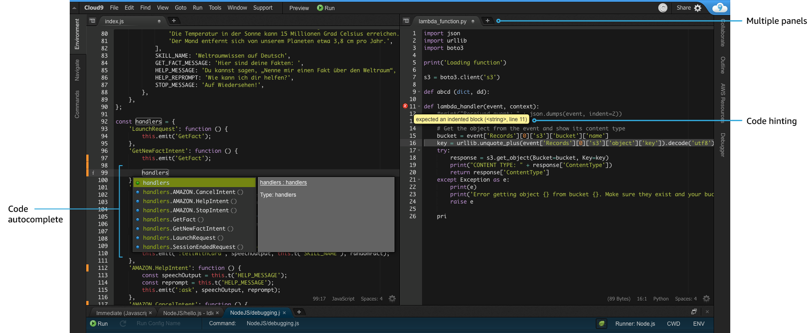

<!-- page_number: true -->
<!-- $size: 16:9 -->


FY19 VORTEX FUNトレーニング
Pythonチーム勉強会
==
第1回
2019.9.28

---

本日のアジェンダ
==

---

Pythonおさらい
==

---
Pythonとは　その１
==
- 1989年、オランダ人エンジニアであるグイド・ヴァン・ロッサム氏が発案、開発
- 「クリスマス休暇の暇つぶし」が開発のきっかけ
- 名称は、イギリスBBCのコメディ番組「空飛ぶモンティ・パイソン」から。本人が熱烈なファンとのこと
- マスコットはニシキヘビ（英語でPython）
- オープンソースプロジェクトであり、利用は無料
- オープンソースプロジェクトのリーダーに与えられる称号「優しい終身の独裁者」を最初に得た人物はこのグイド氏。なお2018年7月に引退している
- 科学技術計算や機械学習用ライブラリが充実しており、これらのジャンルでは事実上、標準言語となりつつある
- OpenStack / ansible / yum などの著名なOSSの開発言語でもある

---

Pythonとは　その２
==
- CLIだけでなく、GUIを持つアプリケーションの開発も可能
- 強い動的型付けのインタプリタ型スクリプト言語（コンパイルが不要）
- { }などのカッコでなく、インデントでループや条件分岐の範囲を表現する
- 推奨される書式が規格化されているため、誰が書いても近い見た目になる＝コードが読みやすい
- インタプリタは、C言語で実装されたCPythonが最も一般的だが、Javaで実装されたJython、.NETで実装されたIronPythonなどがある
- 動作速度は十分高速だが、JavaやCと比較すると5~10分の1程度遅いとされる。ただし、静的型付けをするCython(CPythonではない)では、Cに匹敵する速度が出せるとされる

---

Pythonのバージョン
==

- 現在使われているPythonには、バージョン２系と３系がある
- バージョン３では、利便性の向上やバージョン2での問題が解決された。が、
- バージョン２と３の間には**互換性がない**ので注意
- バージョン２系の最終は2.7で、２０２０年１月でサポートが終了
- RedHat系Linuxは最新版でもPython2が標準（yumなどはPython2で実装）
- 最新のUbuntu,Fedoraなどの先進LinuxではPython3が標準
	> Python2が入っていないので実行時にオプションを付けないとansibleが動かなかったりする
## Pythonはバージョン３系を使いましょう！！
- 参画した案件でPython2を使っていたら、設計担当のSEは無能です。速やかに離脱しましょう。
- どうしても抜けられない場合は、Python3との互換性を保つ仕組みが沢山あるのでそれを使いましょう（今回は割愛）

---

Pythonプログラミングを始めよう
==

---

基本3構造
==
- どんな複雑なプログラムも、以下の3つの構造の組み合わせで動いている
## 順次処理
- 上から順番に処理を実行する

## 条件分岐
- 条件よって処理を選択する
 
## 繰り返し
- 同じ処理を繰り返し実行する

> 人間も同じですね

---

基本3構造のわかり易い例
==

## fizzbuzzプログラム
```
for i in range(1, 101):
    if i % 15 == 0:
        print("Fizz Buzz!")
    elif i % 3 == 0:
        print("Fizz!")
    elif i % 5 == 0:
        print("Buzz!")
    else:
        print(i)
```
- 変数 i が101になるまで i を1づつ増加　（for文、繰り返し）
- i が15、5、3で割り切れたら、それぞれの処理を実行（if文、条件分岐）
- 上記の処理を上から順に実行する（順次処理）

---


変数とは
==

```
print(1+1)
```
### 上記のプログラムは無意味だ。理由は・・・
- 1+1の計算結果を表示することしかできない
```
a = 1
b = 1
print(a+b)
```
### 上記のプログラムは無意味ではない
- 好きな値２つの合計を得られる
## 好きな値を好きなタイミングで入れられる箱、それが変数

---

変数の型
==
- 「1と1を足す」場合、1と数字と見るか文字と見るかで結果が全然違う
	- 数字の場合・・・2
	- 文字の場合・・・11
- 変数の中の値をどう扱うかを決めるため、変数には「型」が必要
- Pythonは「強い動的型付け」言語。つまり・・・
	- 動的型付け・・・変数を宣言したときに型を決める必要がない=実行時にインタプリタがよしなに調べてくれる
	- 強い・・・異なる型同士を計算することはできない。
- Pythonが遅いと言われる理由は、動的型付けであるがゆえに、ループや関数の呼び出しなどの際にインタプリタによる型の確認が行われるから 

---
変数の型（具体例）
==

#### Java（静的型付け言語）の例
- 予め型を宣言しておく必要がある
```java
int a=1;
String b="hoge";
```

#### Pythonでは
- 入れた値によって型が自動で決まる
```Python
a = 1  ##数値を入れたのでaは数値型になる
b = "hoge" ##文字（""で囲む）を入れたのでbは文字列型になる
```
- どちらの言語も、aとbは型が違うので計算することはできない
- ちなみに「弱い動的型付け」言語であるJavaScriptでは計算可能


---

Pythonの変数型
==

### 文字列	
- "（もしくは'）で囲った値を代入した変数は文字列型になる
```Python
moji = "hoge"
suji = "123"
kanji = "風林火山"
```
### 数値型
- 数字を""('')で囲まずに代入した場合は数値として扱われる
```Python
int = 123 ##整数型
float = 123.0 ##浮動小数点型
```
- Python3のint型は64ビット以上の桁も扱える
---

値のまとまりを扱う型
==
- 1つの変数で複数の値を扱いたい場合に使用する。正確には「コレクション」と呼ぶ。
- 変数には、好きな型の変数を好きなだけ入れられる。入れ子することもできる。

### リスト
- いわゆる配列。[]で囲む。順序があり、任意の位置の任意の個数の値を取り出せる。
```
list = [1,2,3,"a","b",[4,5]]
```
### タプル
- 中身を変えることができないリスト。()で囲む。リストよりも軽量で、高速に動作する。
```
tuple = (1,2,3,"a","b"(4,5))
```
> 実際には、（）で囲まなくても「,」で区切るとタプルになる
---

値のまとまりを扱う型（つづき）
==

### 辞書
- キーと値をセットにしたもの。{}で囲む。順序は決められない。キーは重複してはいけない。
```
dictionary = {"key":"value","a":1,"list":[1,2,3]}
```
> 順序を決められるOrderedDictというものもある
### 集合（セット）
- 重複しない値が入る。辞書をキーだけにしたイメージ。重複要素を除いたり、他の集合と集合演算して要素を取り出したりするのに使う
```
set = {1,2,3,"a","b"}
```

---
型の変換
==
- Pythonの型付けは「強い」ので、違う型同士の計算の際は型変換が必須になる
#### 例１　数値から文字への変換
- ユーザーIDがint型だけどそれを使ってRESTAPIを叩きたい時など
```
uid = 10 ## int型
url = "/user/"+str(uid)+"/info" ## /users/10/infoという文字列になる
```
#### 例２　リストから集合に変換
- リストの要素の積集合を取りたいときなど
```
male = ["jin","takashi","chisato"]
female = ["chisato","madoka","risako"]
male_set = set(male) ## 男性名の集合ができる
female_set = set(female) ## 女性名の集合ができる
male_set & female_set ##{"chisato"}
```

---

イテレータ
==
- コレクションをfor文などで扱うと、持っている値を順に取り出してくれる
#### listリストに入っている1,2,3を順に表示する場合
```Python
list = [1,2,3]
for i in list:
  print(i)
```
- この場合、listのことをイテレータと呼ぶ
- タプル、集合、辞書はもちろん、文字列もイテレータ。数値型はイテレータではない

##### （参考）イテレータを知らなかった場合の残念なforループ
```
for i in range(0,len(list)):
    print(list[i])
```
---

ミュータブルとイミュータブル
==
- 変数には、値の変更が可能なものとそうでないものがある
### ミュータブル
- 値の変更が可能なもの・・・リスト、辞書、集合、クラス、インスタンス、など
```python
list = [1,2,3]
l[2] = 4  ## [1,2,4]
```
### イミュータブル
- 値の変更ができないもの・・・文字列、数値、タプル、など
```python
string = "hoge"  ## mogeに変えたい
string[0] = "m"
TypeError: 'str' object does not support item assignment
```
> string="moge"とやるともちろん成功するんですが、理由はまた、次回。

---

関数
==
- ある入力を与えると出力を返す、処理のカタマリのこと	
### 関数を使うとき
##### 何度も出てくる同じ内容の処理を共通化したいとき
- 同じ処理が何度も出てくるコードは読みにくいしメンテナンス性も低い
- ただし、共通化した関数の変更はリスクが大きい。単体テストを書くことが大事
##### if文やループが深くなってきた時
- 他人（数カ月後の自分を含む）は、3重を超えるif文を簡単に理解できないと言われる
- if文が深くなりそうなら、関数で外出ししたほうがよい
##### 処理を部品化したいとき
- 関数にすることで、モジュール（後述）としてimportできるようになる

---

引数とパラメータ
==
- 関数に計算してほしい値は引数として渡す
- 引数の個数は特に制限はない
#### 引数（arguments,実引数）
- 関数に渡す値（計算してほしい値）のこと
```
add_num(1,2)
```
#### パラメータ（parameters,仮引数）
- 関数のほうで受け取る場所のことを、「パラメータ（parameters,仮引数）」と呼ぶ
```
def add_num(augend, addend)
```
- 仮引数は関数の中でしか有効でないので、好きな名前をつけてOK
	- 何をする関数かをわかりやすくするため、具体期な名称を付けたほうがよいとされます

---

位置引数
==
#### 位置引数
- 引数の場所が決まっている。実引数と仮引数の数は合ってないといけない。また、位置を入れ替えると正常に値が渡せない
```Python
def hoge(a,b)

hoge(1,2) # a=1,b=2
hoge(1) # 引数が足りないのでエラー
```
- 仮引数に「*」をつけると、複数の位置引数をまとめられる。関数内ではタプルになる
```
def hoge(a,b,*args)

hoge(1,2,3) # 1,2,(3,)
hoge(1,2,3,4,[5,6,7]) #1,2,(3,4,[5,6,7],)

```
> 習慣的に、タプルの位置引数は *args と書かれる
---

キーワード引数
==
- 'param=1'のように記述した実引数は、キーワード引数と言われる
- 仮引数側（関数側）の見た目は、位置引数と特に変わらない
```
def hoge(a,b)

hoge(a=1,b=2) # a=1,b=2
``` 
- 仮引数に ** をつけると、キーワード引数を辞書で受け取る。辞書のキーの個数制限は特にない
```
def hoge(a,b,**c)

hoge(a=1,b=2,c=3,d=4) # a=1,b=2,{c:3, d:4}
``` 
> 習慣的に、キーワード引数は \**kwargs と書かれる

---

仮引数のデフォルト値
==
- 仮引数には、値が渡されなかった場合に備えて予めデフォルト値を決めておくことができる
```
def hoge(a,b=0)

hoge(1) # a=1,b=0 デフォルト値があるので実引数が1個でもエラーにならない
```
- キーワード引数と混乱しやすいが、こちらは仮引数（関数側）。キーワード引数は実引数（呼び出し側）
- デフォルト引数は、関数が定義された時しか初期化されない。ミュータブルな値を渡すと思わぬバグの原因になるので注意
```
def hoge(a,b=[]): ## リストはミュータブル
    b.append(a)
    return b

hoge(1) ## [1]
hoge(2) ## [2] を期待するかもしれないが、実際は[1,2]になる
```
---

Pythonの定数
==
- 変数と違い、中身を変えることを目的としないものを定数と呼ぶ 
```
FILENAME = './hoge.json'
```
> ただの変数なので書き換えはできる。やらないけど。 
### Python組み込み定数（主要なもののみ）
- 組み込み定数はイミュータブルなので書き換えはできない
##### None
- 値が存在しないことを示す定数。戻り後のない関数、辞書に存在しないキーが指定された時、などなど。
##### True / False
- いわゆる真偽値（bool型）
- 数値のゼロ、空の文字列やコレクションはFalseとなる

---

Pythonをもっと知ろう
==

---

クラス・モジュール・パッケージ・ライブラリ
==
#### クラス
- 関連性のある処理の集まりや、データ構造の定義や、データ構造に対して行う処理などをまとめたもの
- オブジェクト指向で言うところの、インスタンスの設計図でもある
> クラスについては次回詳しく解説するので今は適当な理解でOKです
#### モジュール
- ファイルに書かれたPythonコードのこと
> ファイルに書かれてないものって何やねん・・・と思うかもしれないですが、pythonコマンドを実行したときのREPLやjupyter noteboookなどのコードが該当します
- 関数やクラスでまとめられた処理がファイルに書いてあれば、それは全てモジュールと呼ばれ、他のPythonコードからimportして利用可能

---

クラス・モジュール・パッケージ・ライブラリ（つづき）
==
#### パッケージ
- 複数のモジュールをディレクトリに収めたもの
- ディレクトリにモジュールを入れることで、モジュール名が他人のものと衝突することを防ぐ
- ディレクトリには、必ず \_\_init__.pyというファイルを置く必要がある
- 使用するときは、from パッケージ名 import モジュール名　という階層で指定する
```
from kanaipackage import FetchApi 
```
> importの指定方法はいろいろあります。また、いずれ・・・
#### ライブラリ
- 複数のパッケージを集めたもの
- 単に、沢山のパッケージやモジュールのある場所、程度の意味合いで使われるくらいなのであまり気にしなくてよいです
---

標準/拡張モジュールとpip
==
- Pythonは「バッテリー同梱」＝電池付属で箱を開けたらすぐ遊べるおもちゃのこと＝と呼ばれ、有用なライブラリはランタイムに付属させているのをポリシーとしている
	> 標準で含まれている機能のことをビルトインモジュールと呼ぶ
- ベンダーや有志によって、Python標準以外のモジュール=拡張モジュールも多数提供されている
	- 機能を拡張するもの・・・PyYaml, Jinja2, jaconvなど
	- クラウドサービスや製品のAPIを扱いやすくしたもの・・・AWS boto3など
	- 標準モジュールをより使いやすくしたもの・・・requestsなど
- pipは、ビルトインでないパッケージのインストールと管理を簡単に行うためのツール
- yumやaptでインストールするのが簡単
- ansible,awscli,docker-composeといった、Python製のアプリもpipで入手可能
> OSのパッケージマネージャで入るものはバージョンが古いことが多い


---


Pythonコーディング規約について
==
- 可読性を高めるためコーディング規約が厳しく決められており、**PEP8**としてまとめられている
#### PEP8抜粋
```
1つのインデントごとに，スペースを4回入れる
すべての行の長さを，最大79文字までに制限する
常にUTF-8を使用するべき
2項演算子は、両側に常にひとつだけスペースを入れる
```
- PEP8に従わなくてもシンタックスエラーになることはない
- 書いたコードを自動でPEP8準拠にフォーマットしてくれる機能があるので、積極的に利用するべき
	- autopep8,yapf,flake8など　（pipでインストールする）
	- Pycharmでは、option + command + Lキーの組み合わせでコードを自動整形してくれる

---

開発環境のススメ
==

---

開発環境とは
==

- プログラムを開発しやするするためのアプリケーションのこと
- 昨今ではIDE（統合開発環境）と呼ばれ、プログラムの作成、GUIのデザイン、コンパイル、実行、デバッグ、製品としてパッケージ化するなどの豊富な機能を持つ
### IDEちょっと紹介
- Eclipse
	- Javaの無料開発環境として有名。プラグインが豊富。
- Intellij IDEA
	- JetBrains社によるIDE。 Java以外に、Pycharm（Python）,WebStorm(PHP/HTML)などの派生品がある。無料でもかなり高機能

---

なるべく「開発環境」を使おう
==
- サクラエディタや無垢なvimでもいいんですが・・・
	> ちなみにvimはちゃんとカスタマイズするとIDE並の強力な機能を持ちます

### IDEを使った方がよい理由
- コード補完が効く　→　構文エラーなどを防げる、関数の仕様などを調べる時間を短縮できる
- シンタックスハイライトが効く　→　カッコの閉じ忘れ、スペルミスなどを防げる
- 豊富な補助機能（コードの自動整形、タイポの指摘と自動修正など）と、そのショートカットキーが豊富で作業効率が上がる
- 強力なリファクタ機能を持つ
- 開発→実行（テスト）→デバッグの流れが非常にスムーズ
- ビルドツールやテストツール、DBマネージャなどの外部ツールとの連携が強力
- 見た目がかっこいい＝デキる気がする

---

AWS Cloud9の紹介
==

- 本勉強会では、AWSのサービスである「Cloud9」を利用します


- かっこいい！ 

---

AWS Cloud9の特徴
==

- webブラウザとインターネット環境さえあればどこでもIDEを実行できる。IDEのインストールやメンテナンスは一切不要
- JavaScript、Python、PHP などの言語に対応
- 複数人で同時にコード編集が可能
- 標準で、git / docker / SAM（ServerlessApplicationModel）を提供。チーム開発、単体テストなどをcloud9だけで実施可能
- AmazonLinuxもしくはUbuntuのEC2上で起動しておりシェルコンソールを持つので、sshターミナルの代用としても使える
- Cloud9自体の利用料金は無料。Cloud9の動くEC2にだけ課金される
- ブラウザを閉じて30分後（変更可）に、自動でEC2が停止する

---

Python仮想環境のススメ
==

---

Python製アプリを使うときに起こりうる問題・・・
==
- Pythonで書かれたアプリケーションは、様々なライブラリを利用している事が多い＝依存関係がある
- 複数のPython製アプリを１つのマシン内で動かしたい場合、アプリが依存するライブラリのバージョンが異なったりして問題が起こることがある
	- あるライブラリAを利用するPythonアプリBとCがあったとき、AをバージョンアップしたらアプリCが動かなくなる・・・とか割とよくある	
- アプリが使うPythonのバージョンが違う場合、Pythonをフルパスで指定したり依存ライブラリの場所を指定したりと、結構めんどくさい・・・
> Python2アプリとPython3アプリが同じOSに混在してすることはよくありますね

## Pythonアプリを閉じ込めて、他のPythonアプリと環境が混ざらないようにしよう＝仮想環境

---

具体的にはこんな感じ
==

```
+-----------------------------------------------------+
| +---------------+ +--------------+ +--------------+ |
| |               | |              | |              | |
| |  Python3.7    | | Python2.7    | | Python3.4    | |
| |  ansible==2.8 | | ansible==1.9 | | ansible==2.4 | |
| |  Jinja2==2.10 | | Jinja2==1.15 | | Jinja2==2.11 | |
| |               | |              | |              | |
| |  仮想環境1     | |  仮想環境2     | |  仮想環境3    | |
| +---------------+ +--------------+ +--------------+ |
+-----------------------------------------------------+
```
- それぞれの環境は独立しており、Python自体やライブラリの変更が他の環境に影響を与えることはない
- 仮想環境１でpythonコマンドを実行するとPython3.7が起動するが、仮想環境２の場合はPython2.7が起動する
- ansibleをバージョンアップしたい時、共通のライブラリの依存関係や、既存のバージョンを意識しないで済む = **運用が楽**

---

仮想環境の種類
==
## virtualenv
- 元祖仮想環境（確か）。仮想環境で使うPythonのバージョンを指定することができる
## pyenv
- 未インストールのPythonバージョンをネットから自動で取得できる。パスの通し方が独特らしいのと、日本独自仕様のため嫌いな人も多い
## venv
- Python3.3からビルトイン。venvを実行したバージョンのPythonのみ利用可能。簡単なのでおすすめ。ただしPython3系のみ対応
## pipenv
- 最新型の仮想環境。仮想環境の作成（venv）とパッケージ管理（pip）を合わせた感じ

---

まずはvenvから始めよう
==
```
$ pip list
```
- インストールされたpipモジュールが沢山出てくるはず
```
$ python3 -m venv testenv
```
- testenvという仮想環境ができる。Pythonインタプリタは、Python3.7（実行したコマンドのバージョン）
```
$ source testenv/bin/activate
```
- これだけで、testenvの閉じた仮想環境に入る。プロンプトが変わっているはず
```
(testenv)$ pip list
```
- 最初のpip listの結果とは違うはずだ

---
git基礎
==

---
gitのない世界
==
- これはある案件で使っているファイルサーバのフォルダです

- どれが顧客に渡したものか、すぐにわからない
- どれが最新か、すぐにわからない
- 誰がどのファイルにどんな変更を加えたか、すぐにわからない
### ファイルサーバによるファイル共有では、チームでプロジェクトを進めるのが結構難しい。gitが必要だ・・・

---
gitとは
==
- 分散ソースコード管理システム(分散 Source Code Management system) 
	> 何が分散かは、後程解説いたします
- 誰が、いつ、どのファイルの、どの行に、どんな変更を加えたかの履歴を管理する
- Linuxカーネルのソース管理のために、リーナス御大自らが開発

	- Linuxカーネルの開発者は世界に数万人いて、毎週、2000を超えるファイルに対して1万箇所以上の変更が加えられる。ファイルサーバでは運用不可能
	- git開発のために、リーナス氏は10日間雲隠れしたのこと。名称は、３文字で、過去に使われてないものなら何でも良かったらしい

- SCMには、他にSubversionやMercuralなどがあるが、オープンソースプロジェクトにおいては事実上の標準となっている
### チームでなく一人でプロジェクトを進めている場合、gitは必須の技術ではないです。
---

分散SCMとは
==
### コードが置かれる場所 ＝ リポジトリ が、ローカルマシンやネットワーク上のサーバに分散して置かれるSCMのこと
- 分散でないSCMは、自分の変更を


---


gitとgithub（とgitlab）
==
#### git
- 仕組みの名称。gitコマンドを指したりもする
#### github
- 
#### gitlab


個人でもgitを使おう！
何がいいのか
戻せるので失敗を恐れずにガンガン進める


---
お疲れさまでした
==

### アンケートにご協力ください

#### アンケートURL

---

さぁ飯だ飯だ
==
- お昼休憩 12:00~13:00
)
---

午後の部　その１
==

### - githubのアカウントを取ろう！ -
- gitは覚えておいて損しません！アカウントの登録を今やっちゃいましょう
> すでにアカウントをお持ちの方は登録不要です。
1. 以下へGo!
```
https://github.com/
```
2. 個人メールを使って登録開始！github上で一意なアカウント名が必要になります
	- 必要な方は2段階認証を設定してください
3. 今後、コードレビューなどでアカウント名をお聞きするかもしれません。その際はどうぞよろしくお願いいたしますm(_ _)m
---

午後の部　その２
==
### - cloud9 & githubプチハンズオン - 

1. AWS cloud9を起動しよう
2. cloud9の設定を変えよう
3. python3で hello-world しよう 
5. githubにリポジトリを作ろう
6. ローカルリポジトリを作ろう
7. ファイルをコミットしよう
8. githubにプッシュしよう

---

午後の部　その３
==

### - Pythonプログラミング実践 -
##  「世界のナベアツ」を作ってみよう！！

#### 要件
1. １〜１００までの数のうち、３の倍数と３が付く数の場合、表示がアホになる
	- 2の場合・・・ 2（そのまま）	
	- 3の場合 ・・・　サ〜ン！！
	- ３３の場合・・・サンジュウサ〜ン！！
1. 難しければ、まずは40まで。できれば1000まで作って欲しい
2. nabeatstu という仮想環境内で作ってください

# OK, Let's code!

---

本日は以上です
長時間お疲れさまでした！
==
