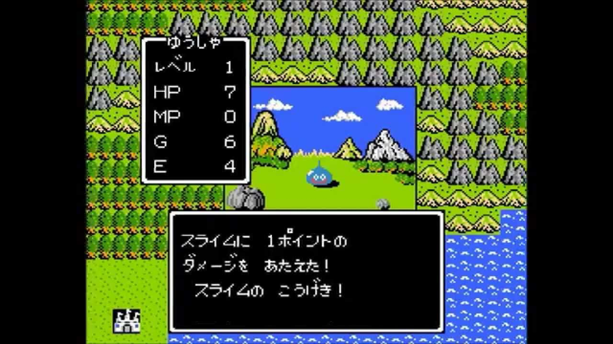

<!-- page_number: true -->
<!-- $theme: default -->
<!-- $size: 16:9 -->

FY19 VORTEX FUNトレーニング
Pythonスキルアップチーム勉強会
==

## 第2回
2019.10.17

---

本日のアジェンダ
==

- tocaroボット作成講座
- オブジェクト指向とは
- Pythonをもっともっと知ろう

---

tocaroボット作成講座
==

---

tocaroボットでやること

片方向
双方向


---

オブジェクト指向とは
==

---

オブジェクト指向とは
==
# 変更しやすいプログラムを作る手法のこと

---
例えば
==
#### 業務システムなどは、
- 数百万行のコード　から成り、
- プログラマー　がたくさん関わって、
- 機能拡張やバグ取り　をしながら、
- 数年間　使う。
### 変更しやすいことは、とても重要！！
- これだけのことなのですが「オブジェクト指向」という名前のせいで「理解しがたいもの」になってます。

---
ちなみに
==
オブジェクト指向の生みの親、アラン・ケイ曰く

「オブジェクト指向（Object Oriented）という名前を付けたのは失敗だった、**メッセージ指向**にすればよかった、、」と悔やんだそうですが、どっちでも同じ未来だった気がします。

---
なお、
==
元宝塚スターの「安蘭けい」とは関係ありません。


---
さて、突然ですがRPGを作ります
==

---
といってもこんなのではなく・・・
==


---
レトロなやつ
==

こういうのをイメージしてください。
しかも戦闘シーンのみ

---
勇者プロフィール
==

- 勇者じん
- おひつじ座　42歳
```
jin_hp = 10
jin_lv = 42 
jin_str = 5
```
- ステータスはこんな感じ。

---
敵プロフィール
==

- スライム
- 永遠のやられ役
```
slime_hp = 5
slime_lv = 1
slime_str = 1
```

---
戦闘プログラム
==

```
jin_hp = 10
jin_lv = 42
jin_str = 5

slime_hp = 5
slime_lv = 1
slime_str = 1

どちらかのHPがゼロになるまで繰り返し：
 slime_hp = slime_hp - (jin_lv * jin_str)
 jin_hp = jin_hp - (slime_lv * slime_str)

HPが残ってる方の人を表示（処理は省略）
```
> スライム瞬殺ですがあまり気にしないでください。そこは本編とは関係ありません。

---
勇者とスライム以外出てこーへんのかこのゲームは。
==

はっはい対応します。

---
対応しました
==
```
jin_hp = 10
jin_lv = 42
jin_str = 5

slime_hp = 5
slime_lv = 1
slime_str = 1

drakee_hp = 7
drakee_lv = 2
drakee_str = 2

ランダムで敵を選ぶ処理（省略）
　じんかスライムのどちらかのHPがゼロになるまで繰り返し：
　※処理は省略

　じんかドラキーのどちらかのHPがゼロになるまで繰り返し：
　※処理は省略
```

---
全部の敵の処理を書いていくつもりか
==
ですよね ^ ^;

---
勝敗の判定を関数にしてみる
==

```
関数 勝敗判定（勇者_hp,勇者_lv,勇者_str,敵_hp,敵_lv,敵_str）
 勇者か敵のどちらかのHPがゼロになるまで繰り返し：
  敵_hp = 敵_hp - (勇者_lv * 勇者_str)
  勇者_hp = 勇者_hp - (敵_lv * 敵_str)
 返却 勝った方のステータス
```
```
jin_hp = 10
※以下省略

slime_hp = 5
※以下省略

drakee_hp = 7
※以下省略

// スライムがあらわれた！
勝敗判定(jin_hp,jin_lv,jin_str,slime_hp,slime_lv,slime_str) 
```

---
コードが読みにくい・・・
==
```
勝敗判定(jin_hp,jin_lv,jin_str,slime_hp,slime_lv,slime_str) 
```
- 関数に渡す値が多すぎるな・・・と思っていると・・・

---
息を切らしてゲームデザイナーが登場
==

「すみません！防御力のこと忘れてました！ハァハァ」
「・・・（まじか）」

- 防御力の変数(_vit)を追加。

```
関数 勝敗判定（勇者_hp,勇者_lv,勇者_str,勇者_vit,敵_hp,敵_lv,敵_str,敵_vit）
 勇者か敵のどちらかのHPがゼロになるまで繰り返し：
  敵_hp = 敵_hp - (勇者_lv * 勇者_str - 敵_vit)
  勇者_hp = 勇者_hp - (敵_lv * 敵_str - 勇者_vit)
```
#### 破綻の予感がする。
- 「すばやさ」とか他のステータスが増えたらさらに長くなる。
- 味方や敵が団体の場合どうなるん・・・

---
何が問題かを整理してみる
==
### キャラの数 * ステータスの数だけ変数がある。
- jin_hp、slime_lvなど・・・
### 勝敗判定の関数に渡す値がどんどん増える（あるいは減る）
- 単純にめちゃ見にくい問題
- 変更があった場合、「勝敗判定の関数を使う側」と「勝敗判定の関数自体」の両方のプログラムを変えないといけない。

---
頭のいい人達が考えました
==

## ステータスをひとまとめにした変数を作ったらええんや！
```
ひとまとめ Chara {
 hp
 lv
 str
 vit
}
```
### 名付けて「ひとまとめ機能」
- キャラのステータスという**個性**をまとめて管理できる。

---
「ひとまとめ機能」を使ってみる
==
- まず、jinとかslimeとかいう名前で使うことを指定

```
ひとまとめ Chara jin
ひとまとめ Chara slime
```
- その後、各ステータスの値を設定
```
jin.hp = 10
jin.lv = 42
jin.str = 5
jin.vit = 5

slime.hp = 5
slime.lv = 1
※以下略
```

---
使い方は従来と変わらない
==
-  「 _ 」 が「 . 」 になっただけ

```
jin.hp = 10
slime.hp = 5

print(jin.hp) // 10と表示される
print(slime.hp) // 5と表示される
```
### え。でも、、、
- 結局、キャラとステータスの数だけ変数を設定していて、変わったように見えないんだけど・・・

---
勝敗判定の関数に渡す変数が少なくて済む
==
```
// スライムがあらわれた！
勝敗判定(jin,slime)
```
```
関数 勝敗判定（勇者,敵）
 勇者か敵のどちらかのHPがゼロになるまで繰り返し：
  敵.hp = 敵.hp - (勇者.lv * 勇者.str - 敵.vit)
  勇者.hp = 勇者.hp - (敵.lv * 敵.str - 勇者.vit)
```
- 変数「jin」に、全ステータスが入っているのでjinだけを渡せばOK。
- 各ステータスは「 . 」を使って関数の中で取り出す。

---
例のデザイナーが走ってきました。
==

「すみません！！剣と鎧のこと忘れてました！ハァハァ」
「・・・（裸か勇者）」

- ひとまとめ機能に、剣と鎧を追加する。
```
ひとまとめ Chara {
 hp
 lv
 str
 vit
 swd // 剣を追加
 arm // 鎧を追加
}
```

---
勝敗判定の関数にも追加
==
- 関数の使い方も、受け取るほうも、変えなくていいけど・・・
```
// スライムがあらわれた！
勝敗判定(jin,slime)
```
```
関数 勝敗判定（勇者,敵）:
 勇者か敵のどちらかのHPがゼロになるまで繰り返し：
  敵.hp = 敵.hp - (勇者.lv * (勇者.str + 勇者.swd) - 敵.lv * (敵.def + 敵.arm))
  勇者.hp = 勇者.hp - (敵.lv * (敵.str + 敵.swd) - 勇者.lv * (勇者.def + 勇者.arm))
```
### これまた破綻の予感
- 「なんとかスキル」とかが増えたらダメージの計算が長くなる。

---
ふと思ふ
==

- キャラの攻撃力や防御力は、HPやレベルと同じで**キャラの個性**。
- キャラの個性を管理している「ひとまとめ」の中で計算してもらって、その結果を貰えばよいのでは？

---
頭のいい人たちが助けてくれた
==
- ひとまとめ機能がパワーアップして、計算ができるようになりました。

```
ひとまとめ Chara {
 hp
 lv
 str
 vit
 swd
 arm

 関数 攻撃力() //攻撃力を計算する関数
  返却 lv * (str + swd)

 関数 防御力() //防御力を計算する関数
  返却 lv * (vit + arm)
}
```
---
使い方はいままでと同じ
==
- ひとまとめ機能の変数は、以下で利用できた。
```
ひとまとめ Chara jin
jin.hp = 10
print(jin.hp) //10と表示される。
```
- 計算の仕方も同じ。
```
jin.swd = 3
print(jin.攻撃力()) //jinの攻撃力が表示される。
```
### これでどうなるかというと・・・

---
勝敗判定の関数が見やすくなった
==
```
関数 勝敗判定（勇者,敵）:
 勇者か敵のどちらかのHPがゼロになるまで繰り返し：
  敵.hp = 敵.hp - (勇者.攻撃力() - 敵.防御力())
  勇者.hp = 勇者.hp - (敵.攻撃力() - 勇者.防御力())
```
#### ごちゃごちゃした計算式が不要。
- キャラに対して「攻撃力と防御力を教えて」と聞くスタイルに変えた。
- 「勝敗の判定」は、どっちが先にHPがゼロになるかを計算すること。「ダメージを計算する」のを、**同じ関数でする必要はない**。

---
見やすくなったのは実はオマケ
==
## 「ダメージの計算」と「勝敗の判定」を分けられたことがポイント
- 攻撃力の計算方法を変えるときは、**攻撃力( )関数**の中身だけを変えればよくなった。
- 逆に、勝敗の判定方法を変えるときに、ダメージの計算部分を気にしなくてよくなった。
## 変更する箇所を狭くすることができた　＝　変更しやすいプログラムになった！！
#### ひとまとめ機能すごい！

---
「ひとまとめ機能」の良さが分かったので
==
## ようやくオブジェクト指向用語の登場
## ひとまとめ機能　＝　クラス
- データ(キャラのステータス)とそれに対する処理（攻撃力と防御力の計算）をまとめたもの
- キャラの「設計図」
```
class Chara {
 hp
 lv
 ...
 def get_atk()
 ...
}
```

---
インスタンスとは
==
## クラスに具体的な値を入れたもの
- クラス自体はただの設計図なので、具体的な値を持っていない。
- インスタンスを新しく作り、値を入れる。
```
jin = new Chara() //ひとまとめ Chara jin
jin.hp = 10
jin.lv = 42
```
- 勇者とかスライムとか、共通のステータス名を持ったキャラを大量に作れる。　=　**jin_hpとかslime_hpとか、キャラ * ステータスの数だけ変数を持たなくてもよくなる**。

---
たい焼きの例よりわかりやすいんじゃないでしょうか
==

---
そしてお気づきの通り
==

クラス、関数、インスタンス、jin、slime、drakee、その他敵
## ↑これ全部が、オブジェクト

## オブジェクトを使って、変更しやすいプログラムを作る　＝　オブジェクト指向プログラミング
> どこまでをオブジェクトと呼ぶかは言語の仕様によって異なります。例えばpythonでは全てがオブジェクトです。

---
オブジェクト指向言語
==
## オブジェクト指向を導入しやすくした言語　＝　オブジェクト指向言語
- オブジェクト指向言語でなくても、頑張ればオブジェクト指向することはできる。
- しかし言語の仕様として無いと、大変めんどくさい・・・

---
例のデザイナー登場
==

「すいません！魔法のこと忘れてましたァァァ！」
「・・・（魔法忘れるなよ）」

## 安心してください。オブジェクト指向がありますよ。

---
魔道士も簡単にできる
==

```
class Magician extends Chara {
 mp
 mat // 魔法攻撃力
 mde //魔法防御力

 def get_atk():
  return Chara.lv * Chara.mat
 def get_def():
  return Chara lv * Chara.mde
}
```
- Charaのステータスを引き継いで（extends）、魔法に必要なステータスだけを定義。
- lvとかhpとか、Charaにあるものはそのまま使える。
- 攻撃力・防御力の計算式は、魔法を使ったものに変える。

---
これぞ「継承」
==
- あるクラスを引き継いで新しいクラスを作ることができる。
- 新しいクラスに必要になるものだけを追加すればよい。
- 同じ名前の関数を書くと、引継元クラスの関数を上書きしてくれる。
```
yuto = new Magician()
yuto.hp = 10
...
yuto.mp = 20
yuto.mat = 10
...
print(yuto.get_atk()) //yutoの魔法攻撃力が表示される。
```
## これも「変更しやすい」プログラムを作るための仕組み


---
関数名は変えなくていいんですか
==
```
get_atk()
```
- 戦士の場合・・・武器でぶん殴る。
- 魔道士の場合・・・魔法で焼いたり爆発させたりする。
- 計算方法が違うので、名前も変えたくなりますが・・・
## 方法は異なるが、「相手にダメージを与える」という目的は同じ = 関数名は同じであるべき。

---
攻撃方法によって名前が違うと大変
==
```
勇者 = yuto
敵 = slime
関数 勇者が魔道士の場合の勝敗判定（勇者,敵）:
 勇者か敵のどちらかのHPがゼロになるまで繰り返し：
  敵.hp = 敵.hp - (勇者.get_magic_atk() - 敵.get_def())
  勇者.hp = 勇者.hp - (敵.get_atk() - 勇者.get_def())
```
- キャラの攻撃方法によって、違う勝敗判定の関数を呼び出さないといけないなんて・・・イケてない！
- イケてないというか、関数の使いまわしが効かないのでこんなコードを書いてはいけません（関数にする意味がない）

## 目的が同じ関数は、中身が違っても同じ名前で呼び出したい！

---
これぞ「ポリモーフィズム」
==
- 目的は同じだが中身の違う関数を、同じ名前で定義する。
- 呼び出す側（クラスを利用する側）のプログラムを変える必要がない。
- 関数の再利用がしやすくなる。
## これまた「変更しやすい」プログラムを作るための仕組み

---
オブジェクト指向３大要素
==
## 継承
- 既存のクラスの機能を拡張して、新しいクラスを作る。
## ポリモーフィズム
- 中身の違う関数を同じ名前で定義して、利用しやすくする。
## カプセル化
- あれ、カプセル化は・・・？

---
また攻撃力の関数の例
==
```
get_atk()
```
- この関数を使うと、**なんだかよくわかんないけど**、キャラの攻撃力がもらえる。
- この関数を使う側は、get_atk()の中でどんな計算をしているのか知る必要がない。
	- 物理攻撃なのか、魔法攻撃なのかとか。


---
これぞ「カプセル化」
==
- クラスや関数は、入力と出力の仕様だけ決めておく。
- クラスや関数を使う側は、どんな処理がされているかを知る必要がない。
### = クラスや関数の処理内容を、自由に変更することができる。
## これまた！「変更しやすい」プログラムを作るための仕組み
> ネットワークの「レイヤ分け」も同じ考え方です。

---
オブジェクト指向３大要素
==
## 継承
- 既存のクラスの機能を拡張して、新しいクラスを作る。
## ポリモーフィズム
- 中身の違うメソッドを同じ名前で定義して、利用しやすくする。
## カプセル化
- クラスや関数を使う側が、その中身を意識しなくてもよい。

## 覚えて帰ろう！変更しやすいプログラムを作る３大要素！


---
おまけ
==
## メソッドについて
- クラスの中に書かれた関数のことを「メソッド」といいます。
- 呼び方が違うだけで、関数と同じです。

## カプセル化の補足
- クラスのプロパティ（jin.hpのhpなど）への直接のアクセスを禁止することも含まれます。
- クラス外から意図せず値を変更されることがバグの発生につながるからです。
- pythonの様に、プロパティへの直接アクセスを制限していない言語もあります。

---
おまけその２
==

## swd(sword、剣)という変数名は非常にイケてないです。
```
class Chara {
 name
 hp
 lv
 str
 vit
 swd
 arm

 def get_atk() //攻撃力を計算する関数
 return Chara.lv * (Chara.str + Chara.swd)
```
- なぜでしょうか

---
答え
==

## 「剣」の攻撃力以外を代入しにくくなる
- 武器が「槍」「弓」「三節棍」「ボウガン」「M4 SOPMOD」「DSR-1（.338ラプアマグナム）」といった、剣でないものの攻撃力を入れるときに違和感を感じる（剣じゃないのにswdなの・・・？）
### （オブジェクト指向に限らず）プログラミングするときは、「可能な限り抽象的な命名」を心がけましょう！

---

Pythonをもっともっと知ろう
==

---

Pythonでは全てがオブジェクト
==


---

本日もありがとうございました
==

### アンケートにご協力ください
