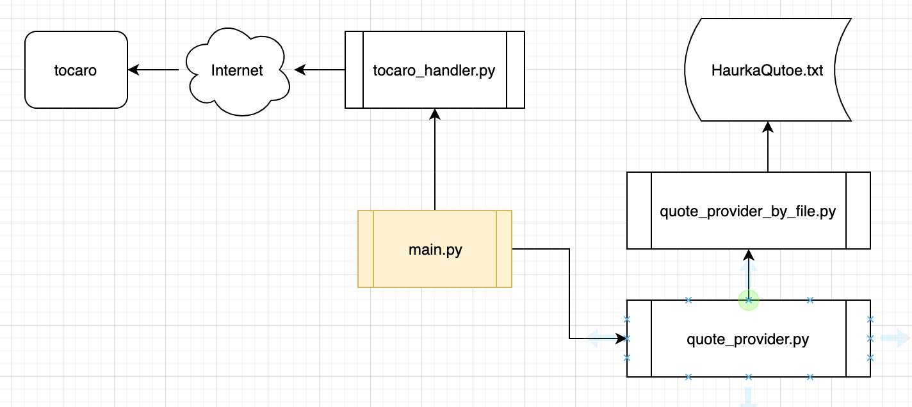
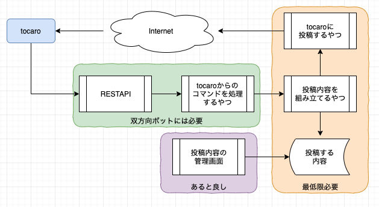

<!-- page_number: true -->
<!-- $theme: defalut -->
<!-- $size: 16:9 -->

FY19 VORTEX FUNトレーニング
Pythonスキルアップチーム勉強会
==

## 第3回
2019.11.20

---

本日のアジェンダ
=
tocaroボットサンプルの紹介
難易度別tocaroボット作成例

---

tocaroボットサンプルの紹介
==

---

tocaroボット作ってきました
==
- ハルカ（嫁）の言い間違いをtocaroに投稿するボットです
- 名付けて「ハルカボット」
- 一方的にしゃべるだけでこちらの話は聞いてくれません
- 自動投稿はまだ仕込んでないのでスクリプトを実行しないと投稿しません
- 動かしてみます

---

中身
==


---

仕組み解説
==
- ディレクトリ構成
```shell
.
├── HarukasQuotes.txt
├── main.py
├── quote_provider_by_file.py
├── quotes_provider.py
└── tocaro_handler.py
```

---

仕組み解説
==
##### HarukasQuotes.txt
- 名言（言い間違い）ををテキストで記載
- １行につき１言い間違いを記載する
##### tocaro_handler.py
- tocaroにメッセージを投稿するためのモジュール
- tocaroメッセージフォーマットを辞書で持つ
- メッセージの辞書に値を入れるためのメソッドを持つ
- send2tocaro()メソッドを実行するとtocaroにメッセージを投稿する

---

仕組み解説
==
##### quote_provider_by_file.py
- 与えられたファイル名から名言をランダムで１つ選び、番号と一緒に辞書型で返却するモジュール
##### quote_provider.py
- 名言を提供するモジュール
- 名言の提供元が変わってもmain.py（後述）を変更しなくても済むよう、 QuoteProviderByFileクラスを継承している
> これくらいの規模なら別にこんなことしなくてもいいんですが、、、趣味みたいなものです
  
---

仕組み解説
==
##### main.py
- ボットの本体。実行すると、tocaroにメッセージを投稿する。cronで動かすか、lambdaに仕込めば自動投稿ができる
- QuoteProviderをインポートして、get_quote()で名言を一つ入手
- TocaroHandlerをインポートして、メッセージを組み立てたあと、send2tocaro()でtocaroにメッセージを投稿している
- 投稿先URLは、OSの環境変数で与える。環境変数にしている理由は３つ
  - gitにURLを置きたくないないため
  - tocaro_hendler.pyは他のボットでも使いまわしたいので、コード内にURLを直接記載したくないため
  - AWS lambdaには、環境変数で値を渡す仕組みがあるのでこうしておくと利便性が高い

---

仕組み解説
==
- ハルカボットくらいの規模なら、１枚のPythonファイルにベタ書きでもよいですが、
  - チームで分担して開発する場合
  - 他人（数カ月後の自分を含む）がコードを読んだときの視認性
- などを考慮すると、モジュールに分けたほうがいろいろ便利です
- Let’sモジュール化

---

tocaroボットに必要な機能
==
### メッセージを投げるだけの場合
- tocaroへの投稿機能
- 投稿データ用のデータ保持機能
- 投稿データの追加、変更、削除の方法 
### チャットボットにしたい場合
- tocaroに入力されたメッセージを受け取るAPI
- APIが受け取ったメッセージを解析していろいろ処理する機能

---

tocaroボット構成イメージ
==


---

ここで一旦、アプリケーションあたりの話をさせてください
==

---

webアプリケーションとは
==
- webブラウザで利用できるアプリケーションのこと
- 何かを入力してその結果が反映されるようなwebサイトはwebアプリと呼べる
  - webメール、ECサイト、ブログ、webチャット（tocaroも）などなど
  - コンテンツが置いてあるだけのwebサイトはwebアプリとは呼ばない
### そもそもアプリケーションとは
- OSにインストールして使う、ソフトウェアのこと
- コンピュータを利用する＝アプリケーションを利用する
- webブラウザで利用するwebアプリに対し、OS上で直接動いているアプリを「ネイティブアプリ」と呼ぶ  

---

アプリケーションとデータベースの関係
==
- アプリケーションは、必ずなにかしらのデータを扱っている
  - 商品情報とか、買い物かごの中身とか、在庫情報とか、顧客情報とか・・・
- データは、データベースに置かれる
- データベースを直接操作しても、情報を扱うことはできる
  - SQL文を駆使して、欲しい商品を探し出して買い物かごに入れることは出来るだろう
- でも、それでは扱いにくい！
- データベースの操作をさせつつ、人間が操作しやすい画面を提供するソフトウェアがあればよいのでは＝アプリケーションの誕生
### アプリケーションとは、データベースを扱いやすくするためのもの

---

REASTAPI超概要
==
- HTTPでデータベースにアクセスできるようにしたもの
> ほんとはちょっと違いますよ
- データベースのレコードやカラムをURLで表現し、HTTPメソッドでアクセスする
```
GET /kakugen/1 # 格言１を取り出す
```
```
POST /kakugen/2 # 格言２を書き込む
```
- 最近のwebアプリケーションでは、画面の描画はブラウザ側で行い、サーバ側はRESTAPIでデータベースだけ提供しているケースが多い

---

難易度別tocaroボット作成例
==
- いきなりボット作れとか言われても困りますよね＾＾；
- ボットの作成例を、難易度別に紹介します

---

最低難易度：片方向＆データベースなし＆lambdaなし版
==
- tocaroに一方的にメッセージを送付するボットです
- メッセージはテキストファイルなどにおきます
- 自動でのメッセージ投稿にはダッサいcronを使います
### メリット
- データベースを使わないので気楽に作れる
- クラスだのモジュール化だの知らなくても動くものが多分できる 
### デメリット
- cronというダサい仕組みを使うことになるので、EC2インスタンス代が余分にかかる。誰が払ってると思ってるんだ！ヽ(`Д´)ﾉﾌﾟﾝﾌﾟﾝ

---

低難易度：片方向＆データベースあり＆lambdaなし版
==
- tocaroに一方的にメッセージを送付するボットです
- 投稿情報の管理にデータベース(RESTAPI)を使います
- 自動でのメッセージ投稿は、ダッサいcronを使います
### メリット
- RESTやデータベースの知識を得ることができる
### デメリット
- cronというダサい仕組みを使うことになるので、EC2インスタンス代が余分にかかる。誰が払ってると思ってるんだ！ヽ(`Д´)ﾉﾌﾟﾝﾌﾟﾝ

---

中難易度：片方向＆データベースあり＆lambdaあり版
==
- tocaroに一方的にメッセージを送付するボットです
- AWS lambdaを使って自動でtocaroに投稿します
### メリット
- lambdaを使うので、投稿用のEC2インスタンス代がかからない
- AWSのモダンなアーキテクチャを体験できる
### デメリット
- lambdaとcloudwatch eventsの学習コストがかかる

---

高難易度：双方向＆データベースあり＆lambdaあり版
==
- tocaroからコマンドを受け付け、適切なメッセージを返すボットです
- コマンドの受付と解析部分を実装する必要があります
### メリット
- インパクトのあるボットを作れる
- それなりに高度なPythonコードを書くことになる
### デメリット
- tocaroからアクセスするRESTAPIサーバを構築する必要がある
- tocaroから送信するコマンドの仕様などの設計が必要になる
- tocaroの仕様のせいで、SSLv3を受けるサーバを立てて独自ドメインとSSL証明書を取得しないといけない

---

tocaroボット構成イメージ（再び）
==


---

チーム活動＆tocaroボット相談コーナー
==
- チームごとに分かれて、どんなボットを作るか、実装を始めるか、自由にこの時間をお使いください
- Pythonの学習に当ててもOKです（ボットの企画が優先ですが）
- ボットを作るにあたってわからないこと、相談したいことがあれば質問してください
  - 公開質問でも、こっそり聞きに来て頂いてもOKです！

---

本日は以上です
お疲れさまでした！
==