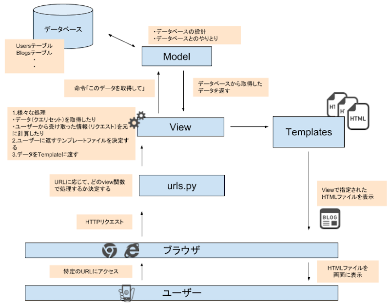

<!-- page_number: true -->
<!-- $theme: defalut -->
<!-- $size: 16:9 -->

FY19 VORTEX FUNトレーニング
Pythonスキルアップチーム勉強会
==

## 第4回
2019.12.19

---

本日のアジェンダ
=

django
startprojectとstartappの違い


model
adminuser


---

---

webアプリケーションとは（おさらい）
==
- webブラウザで利用できるアプリケーションのこと
- 何かを入力してその結果が反映されるようなwebサイトはwebアプリと呼べる
  - webメール、ECサイト、ブログ（の管理画面）、クラウド家計簿、などなど
- コンテンツ（文章、写真など動きのないもの）が置いてあるだけのwebサイトはwebアプリとは呼ばない
- 構成は大体こんな感じになっている
```
webブラウザ - Internet - webサーバ - webアプリケーションサーバ - データベース
```
---

webアプリケーションの歴史
==
### 動きのない時代
- HTMLを読み込んで表示するだけ
- 文字と絵を表示するだけのwebページが主流
- ハイパーリンクが登場。テキストをクリックすると次のテキストが表示され、コンピュータ上でのドキュメント閲覧が劇的に進化した
##### 構成
```
webブラウザ - Internet - webサーバ
```

---

webアプリケーションの歴史
==

### CGIの時代
- インターネット黎明期(Windows95 Plus!、第1次ブラウザ戦争)
- webサーバ内でPerlスクリプトを動かして、表示するたびに変化のあるwebページが出来るように進化した
  - アクセスカウンター、掲示板などが流行
- JavaScriptは存在したが、互換性が低かったり機能が低く、ページの装飾程度にしか使われていなかった
##### 構成
```
webブラウザ - Internet - webサーバ(スクリプトが動く) (- データベース)
```

---

webアプリケーションの歴史
==
### アプリケーションサーバの時代
- データベースを利用して、動的にHTMLを作成できるアプリケーションサーバが登場
  - ユーザーの入力や指示に応じてページ内容を変更できるようになった
  - Javaが一気に時代の表舞台に
- 業務アプリやECサイトなどが劇的に発展した
##### 構成
```
webブラウザ - Internet - webサーバ - webアプリケーションサーバ - データベース
```

---

webアプリケーションの歴史
==

### モダンwebアプリの時代
- Ajaxが登場、ページの表示とサーバアクセスが別タイミングに
- JavaScriptが、ブラウザ側でコンテンツを生成するようになった
- webサーバは、静的ファイルとデータベースだけを提供するように　
  - 静的ファイル・・・枠組みだけのHTML/CSS、JavaScript、メディア関連
  - **表示内容はwebブラウザ上で生成されるので、weサーバはコンテンツの元ネタとなるデータベースを提供するようになった**
  - **データベースへは、HTML同様URL形式でアクセスする**
##### 構成
```
webブラウザ - Internet - webサーバ - APサーバ(DBアクセス用サーバ) - データベース
```

---
 
 データベースにwebブラウザからでアクセスできるように
==
- データベースのアクセス先をインターネット経由で開けるわけにはいかない
  - SQLは自由度が高いので危険
  - パスワード認証するので、パスワードが漏れたらOUT
  - 上記に対応するためのセキュリティ対策をするより、データベースとしてやることいっぱいるある

--- 

というわけでwebAPIが注目されている（前からだけど）
==
### ｗｅｂサイトの持っているデータを利用できる
- 天気予報、為替、飲食店情報、などなど
### プログラムを書くと自動化できる
- マウスポチポチで情報取得しても自動化できない（できるけど大変）
## webサイトの持つデータベースへのアクセス経路として、APIを提供するのが最良の方法！
- 


---


RESTAPIとは
==
- URLを使ってデータベースにアクセスできる仕組み
> 本当はもっと細かい話があるのですが今回は割愛します
- HTTPメソッドで、データの読み書き・更新・削除（CRUD)を実現する 
  - GETで読み出し、POSTで書き込み、PUTで更新、DELETEで削除
---

RESTAPIの例
==
- こんな感じの名言データベース（のテーブル）があったとする

| id   | quote                                                              | author       |
| :--- | :----------------------------------------------------------------- | :----------- |
| 1    | 明日死ぬかのように生きよ。永遠に生きるかのように学べ               | ガンジー     |
| 2    | 10%の才能と20%の努力、30%の臆病さと、残る40%は、運、だろうな。。。 | デューク東郷 |
| 3    | 自分で薪を割れ、二重に温まる                                       | フォード     |

---

RESTAPIの例
==
### RESTAPIのURLが http://kakugen.com だった場合

- idが1番の格言を読み込みたい場合
```
curl http://kaugen.com/quote/1
```

- 格言を追加したい場合
```
curl -X POST -d '{"quote":"talk is cheap.show me the code.","author":"トーバルズ"}' http://kaugen.com/quote/1
```

---

webAPIの紹介
==

---

ちゃんとしたwebアプリを作るのは結構大変
==
#### 入力された文字をチェックしないといけない
- フリガナの欄にちゃんとカタカナを使っているか
- メアドや電話番号のフォーマットは正しいか、などなど
#### セキュリティの問題
- 存在しないURLを叩かれたときに弾く処理がいる
- フォームの文字列を使ってSQLを叩く場合、SQLインジェクションされる可能性がある
#### 定形処理
- 商品一覧表示など、よく使う処理を何度も書くのか（コピペではメンテナンス性が下がる）
- ログインしてるかどうかの確認も定形処理の一つ

---

webアプリケーションフレームワークとは
==
- 最小限の労力でwebアプリを開発できるようにする仕組み
### 「当たり前のこと」を全部勝手にやってくれる
- URLの定義と、そこへアクセスされたときの処理
- フォームに入力された文字の書式チェック
- ログインしていない場合、自動でログイン画面にリダイレクト
- 一覧表のページをDBのテーブルから自動生成
- 存在しないURLへのアクセスに404を返す
- データベースの管理画面はフレームワークに組み込み済み

---

Python製webフレームワーク
==
### bottle
- 一本のPythonコードだけでできた、超軽量フレームワーク
- データベース機能は持っていないのでSQLを使う必要がある
### flask
- bottleより高機能なフレームワーク
- 最低限の機能だけ持ち、必要になった機能は跡から追加するスタイル
- githubでのPython webフレームワーク人気度No.1
- Netflixなどで利用されている

---

django（ジャンゴ）の紹介
==
- webアプリに必要な機能をほぼ全て盛り込んだ、重量級フレームワーク
- 簡易的なwebサーバを持っていて、開発物をすぐにテストできる
- ユーザー認証機能を組み込んでいるので、ログインが必要なアプリも割とすぐ書ける
- データベースは組み込み済み。もちろん、MySQLなども使える
- データベースをPythonのオブジェクトとして扱える、ORマッパーを持つ
  - データベースの定義にも取り扱いにもSQLを一切使わない
- URLと処理の紐付けが非常に簡単
- HTMLの生成を単純化する強力なテンプレート機能がある
- RESTAPIを簡単に作成出来るdjango rest frameworkを提供
- Instagramなどで利用されている

---

django rest frameworkの紹介
==
- djangoにRESTAPI機能を追加するフレームワーク 
- 略してDRF
- djangoに追加しているだけなので、通常のサイトの作成ももちろん可能
  - というか、通常のサイトにRESTAPIを追加するイメージ
- djnago同様、pipで簡単にインストール可能
- 通常のdjangoと変わらず利用できるので学習コストが低い
  - 単純なCRUDだけなら、30分ほどで新規APIが実装できる
- 開発したAPIをすぐに試すことができる、APIのテスト画面を提供する

---

djangoでのアプリ開発の流れ
==
- djangoのインストール
- プロジェクトとアプリケーション作成
- モデル（データベース）作成
- ビュー作成
  - URLにアクセスされたときの、返すレスポンスを決める
- ルーティング設定
  - URLと、ビューを紐付ける
- django起動

---

djangoでのwebアプリケーション構成図
==


> https://djangobrothers.com/tutorials/memo_app/mtv/ 


---

djangoを使ってみよう
==
- cloud9を起動して、Terminal起動
- djangoテスト用ディレクトリ作成
```
mkdir hogebot
```
- テスト用ディレクトリに移動
```
cd hogebot 
``` 
- Python仮想環境を作成
```
python3 -m venv venv
``` 
- 仮想環境内に移動
```
source venv/bin/activate
```

---

djangoを使ってみよう
==
- djangoのインストール
```
pip3 install django 
```
- django rest frameworkのインストール
```
pip3 install djangorestframework
```
- インストール確認
```
pip3 list
```

---

プロジェクトとアプリケーションの作成
==
- プロジェクト作成
```
django-admin startproject hogebot 
```
- アプリケーション作成
```
cd hogebot
python3 manage.py startapp api
```
- アプリケーション「api」のディレクトリに移動
```
cd api 
```

---
プロジェクトとアプリケーションとは
==
- 例えばECサイトを作るとき、ECサイト全体をプロジェクトと呼ぶ
- ECサイト内の、商品一覧、決済画面、ユーザー情報など個々の機能のことをアプリケーションと呼ぶ
- 最低、1プロジェクトと１アプリケーションが必要
- 大規模でなければ、１アプリケーションで十分
- 今回は、hogebotプロジェクトを作成、apiというアプリケーションを作成

---

初期設定
==
- 以下のファイルをcloud9で開く
```
hogebot/hogebot/settings.py
```
- 以下の項目を編集する
  - ALLOWED_HOSTSを以下に変更
  ```
  ALLOWED_HOSTS = ['*']
  ```
  > アクセス元ではなく、自分のwebサイト名を書く設定なので注意
  - INSTALLED_APPSリストに以下を追加
  ```
  'api'
  ```
--- 

初期設定
==
- settings.py続き
  - LANGUAGE_CODEを編集
  ```
  LANGUAGE_CODE='ja'
  ```
- TIME_ZONEを編集
  ```
  TIME_ZONE='Asia/Tokyo'
  ```

---

モデルの作成
==
- アプリケーション「api」で使用するデータベースを作成する
> djangoでは、モデル＝データベースと理解してOK
- models.pyを編集して以下を追加して、保存
```python
class Quote(models.Model):
    quote = models.TextField()
```
- 今回はdjangoに組み込みのsqlite3を使用するため、データベースの設定は不要
  - もしMySQLやPostgresSQLを使いたい場合はsettings.pyに設定する（ので興味ある方はやってみてください）

---

マイグレーションの実行
==
- マイグレーションとは、モデルのPythonコードからデータベースを作成すること
- 以下を実行する
  - migrationファイルという、データベースの構成を書いたファイルが生成される
```
python3 manage.py makemigrate
```
- 続けて以下も実行する
  - この作業で、データベースがsqlite3に作成される
```
python3 manage.py migrate
```

---

django管理用ユーザーの作成
==
- djangoの管理者ユーザーを作成する
  - ユーザー名を聞かれるので、忘れない名前を入力する
  - メアドは体をなしていれば適当でOK
  - パスワードは忘れないものを入れる。簡単な場合は、簡単だけどいい？って聞かれるのでYを選ぶ
```
python manage.py createsuperuser
```

---

django起動！
==
- 以下を実行してdjangoを起動する
```
python3 manage.py runserver
```
- 起動結果確認
```
(snip))
Starting development server at http://127.0.0.1:8000/
Quit the server with CONTROL-C.
```
- ↑の状態で停止すればOK。djangoが起動してHTTPアクセスを待ち受けている状態

---

djangoに接続！
==
- webブラウザで以下URLに接続
```
http://localhost:8000/
```
- ロケットが飛んでいる画面になればdjango起動成功！
### と、なればよいのですが、残念ながら〇〇（自主規制）な情シスの仕様により、手元のブラウザからcloud9のweb画面に接続することはできません（図解）
##### すぐ実施できる回避方法は以下の通り
- aptもしくはyumで、lynx（テキストベースwebブラウザ）をインストールする
- 講師の実演を指をくわえて見る

---

django 管理画面に接続！
==
- webブラウザで以下URLに接続
```
http://localhost:8000/admin/
```
- createsuperuserで作成したユーザー名とパスワードを入力

---

管理画面にQuoteモデルがない？
==
- モデルを作っただけでは、管理画面には表示されない
  - 管理画面はあくまでおまけ？という意図？
- api/admin.py以下を追加する
```python
from .models import Quote

@admin.register(Quote)
class Quote(admin.ModelAdmin):
    pass
```
- djangoが自動で再起動し、コードが読み込まれる
- 管理画面にQuotesが表示される
> Quotes になっているところに注目

---

django rest frameworkの組み込み
==
- pipでインストールしただけで、DRFはまだdjangoに組み込まれていない
- hogepj/settings.pyを開いて以下を追加
```
INSTALLED_APPS = (
  ...
  'api', <- さっき書いたやつ
  'rest_framework', <-カンマを忘れずに
)
```
- これだけです。簡単！
  
---

シリアライザーの設定
==
### シリアライズとは
- ハードウェア・OS・言語などのアプリケーション基盤に依存したデータを、XMLやJSONなどの基盤に依存しない形式に変換すること
  - webは様々なOSやハードウェアで利用されるため、特定の基盤に依存したデータでは通信が成り立たない
  - djangoでのデータベースはPythonのオブジェクトなので、

---

ビューの設定
==


---

ルーティングの設定
==

---


---

デプロイの話
==
- djangoのwebサーバは開発用の簡易的なサーバのため、アプリケーションの運用には向いていない
  > django公式では禁止されています
  - 大量のトラフィックをさばくだけの性能を持っていない
  - セキュリティ対策がされていない
  - SSL/TLSのトラフィックに対応していない
- そもそも、実際にサービスを提供するときにcloud9上で実行するわけにはいかない
- 実際にサービスする際は、インターネットとdjangoの間にwebサーバを配置すること

---

デプロイの方法（webサーバなし版）
==
1. djangoアプリケーションのディレクトリ（今回の例では、hogepj以下）をzipなりで圧縮する。
> gitで管理している場合はこの手順は不要
2. インターネットからアクセスできるところにEC2でVMを構築する
3. djangoとdjango rest frameworkをpipでインストールする
4. 上記VMにSSHでログインし、zipを展開するか、git cloneしてdjangoアプリをVMに展開する
5. djangoアプリをrunserverコマンドで起動する
#### cloud9でやってたことをVMでやるだけなので楽ですが、webサーバを使っていないので、本来この方式はだめです

---

デプロイの方法（webサーバあり版）
==
1. インターネットからアクセスできるところにEC2でVMを構築する
2. 上記VMに、nginx（webサーバ）をaptやyumなどでインストールする
3. 以下の例を参考にnginx.confを作成する
  https://github.com/JinKanai/tocaro-bot-framework/blob/feature/frameworking/example/webserver/harukabot.conf
4. 上記設定ファイルを、インストールしたnginxの設定ファイルのディレクトリに置く　
5. webサーバなし版と同じ手順で、djangoアプリを展開する

---
デプロイの方法（webサーバあり版）
==
6. Python仮想環境内で、uswgiをインストールする
   ```
   pip install uwsgi
   ``` 
7. 以下の例を参考にuwsgi.iniを作成する
https://github.com/JinKanai/tocaro-bot-framework/blob/feature/frameworking/example/harukabot/uwsgi.ini
8. uswgiを起動する
9. nginxを起動する
10. http://VM:8080/にアクセスできればOK！

---

uwsgiについて
==
- 前ページで触れたとおり、「めんどくさい」です
## こんなめんどくさいをしないといけないのも、AWS API GatewayでAPIを作れないtocaroの〇〇（自主規制）仕様のせいです。
> コマンドを受け付けない場合はAPIGWでも作れます
- uwsgiの使い方は「django uwsgi」とかでググるとたくさん出てきます
- dockerを勉強する気概のある方は、tocaro-bot-frameworkのコンテナ構成をそのまま使ってもOKです

---

AWS Lambda簡易講座
==

---

AWS Lambdaとは
==
- サーバを構築せずに、アプリケーションコードを実行出来る仕組み
  - サーバのサイジングや構築など、サーバ周りの作業が一切不要
 - アプリケーション作成者が、アプリのロジックだけに専念できる
 - Lambdaファンクションを直接動かすことはAWSコンソールからしかできないため、利用するにはトリガーの設定が必要
   - タイマー、AWSの各種イベント、webAPIへのアクセス、など
 - 実行された回数と実行時間に対してのみ課金される
   - 月100万回の呼び出しまでは無料
   - 月40万秒までの実行時間に対しては無料（デフォルト設定の場合）

---

Lambdaの利用例
==
### チャットボットへの定期投稿
- タイマーをトリガーにして、定期的にtocaroなどに投稿する
### AWSリソースの異常通知
- cloudwatchイベントをトリガーにして、異常状態がしきい値を超えたらメール通知するなど
### ログの整形と保存処理
- AWS kinesisと組み合わせて、受信したログを整形してデータベースなどに配置する

---

Lambdaへのコードの配置とテスト方法
==

### 実演しますので、試してみたい方は手元の環境でやってみてください


---

企画アドバイスコーナー
==
- 各チームの企画についてアドバイスさせていただきます
> 資料を手抜きしたかったわけではありません


---
アプリケーションとデータベースの関係
==
- アプリケーションは、必ずなにかしらのデータを扱っている
  - 商品情報とか、買い物かごの中身とか、在庫情報とか、顧客情報とか・・・
- データは、データベースに置かれる
- データベースを直接操作しても、情報を扱うことはできる
  - SQL文を駆使して、欲しい商品を探し出して買い物かごに入れることは出来るだろう
- でも、それでは扱いにくい！uuu
- データベー1kk11uuuuuu{uuuuスの操作をさせつつ、人間が操作しやすい画面を提供するソフトウェアがあればよいのでは＝アプリケーションの誕生
### アプリケーションとは、データベースを扱いやすくするためのもの

---

